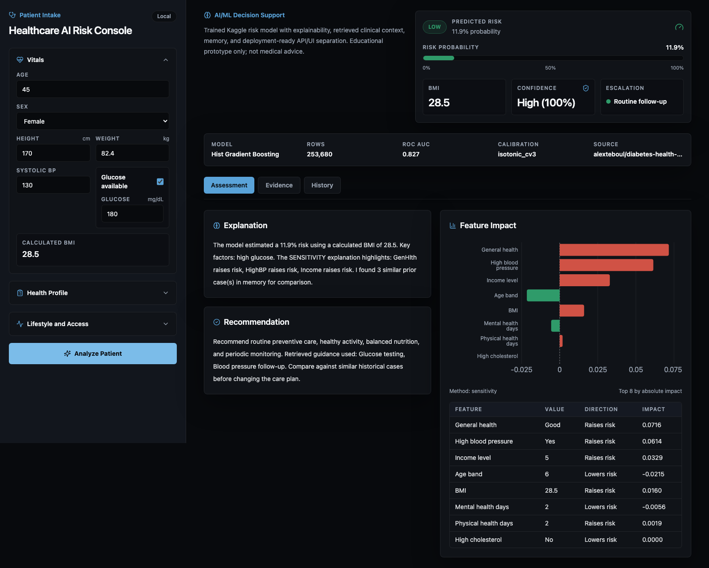
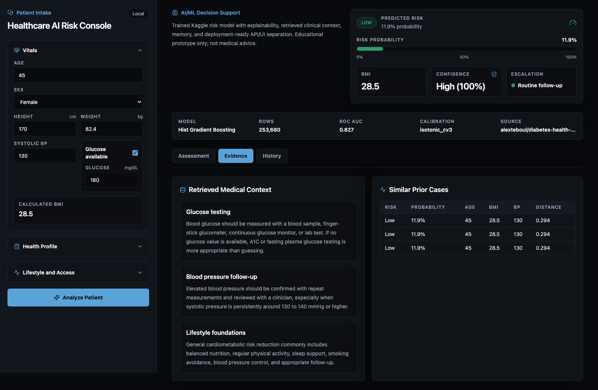
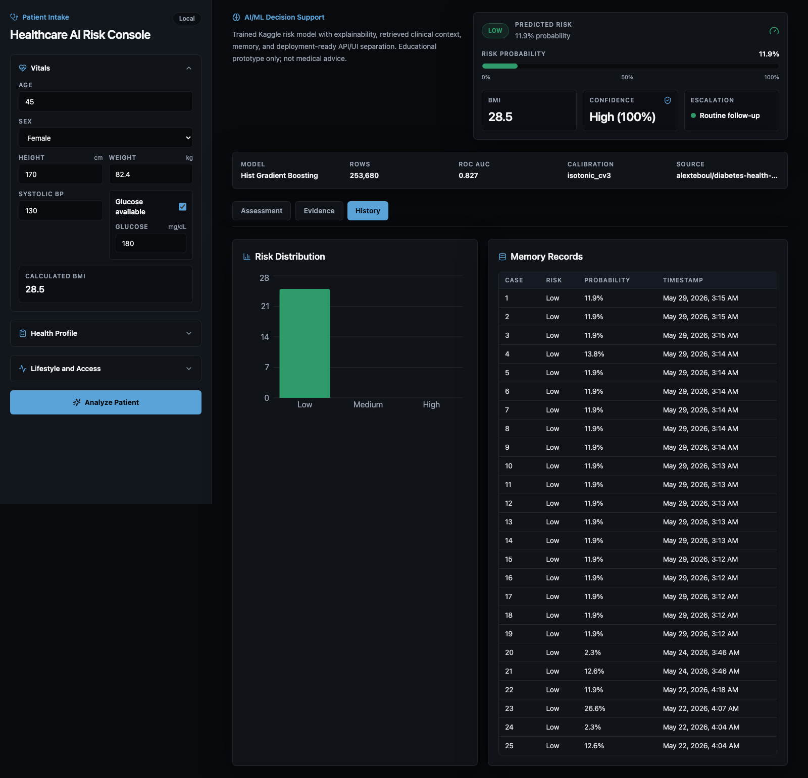
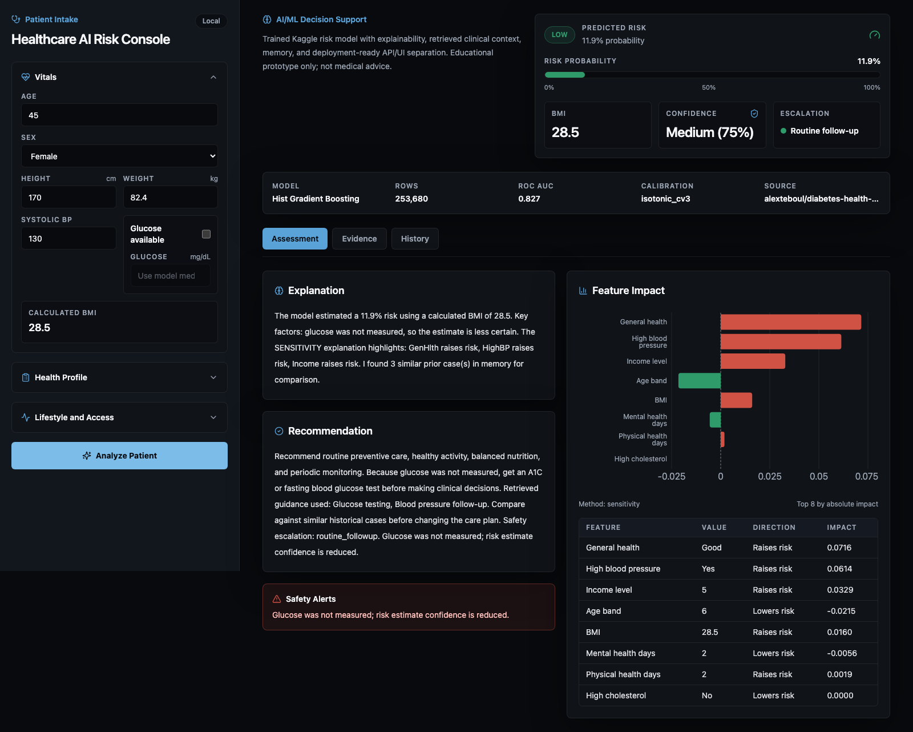
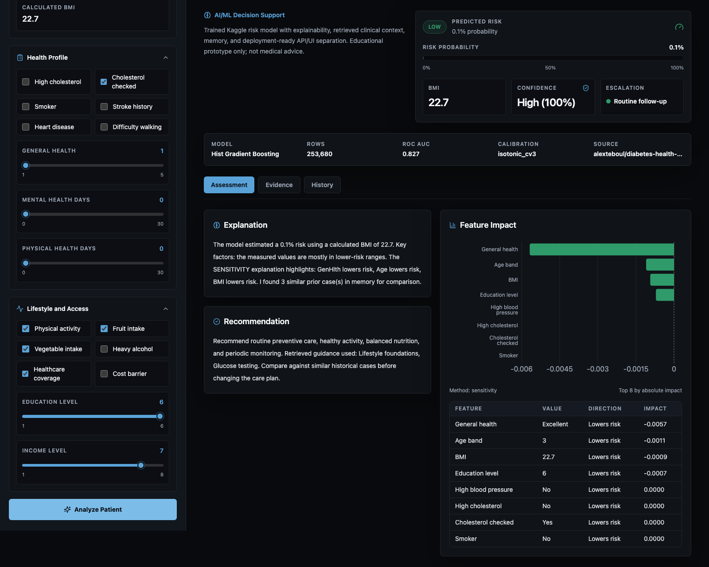
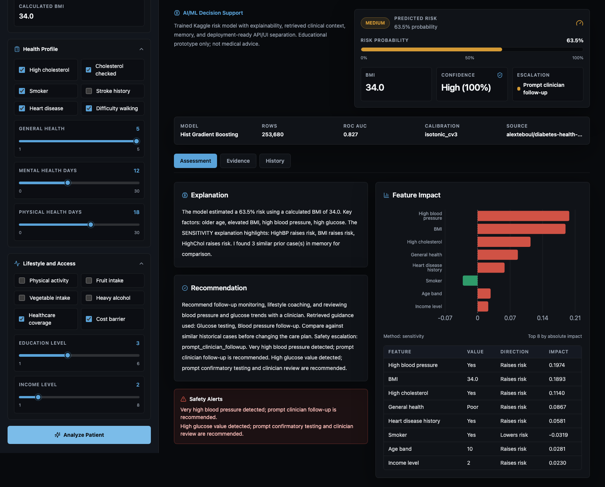
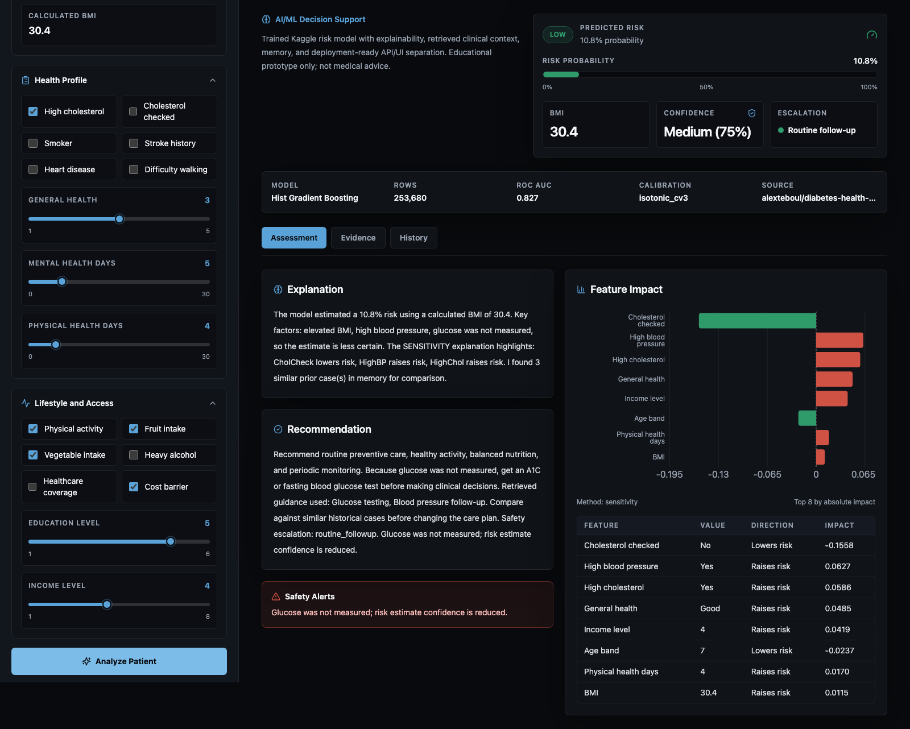

# Healthcare AI Risk Console

End-to-end healthcare AI prototype: **Kaggle-trained ML**, **multi-agent orchestration**, **FastAPI inference**, and a **production Next.js dashboard**.

> **Educational prototype only — not medical advice.** Not a medical device. Not clinically validated.

**Repository:** [github.com/adit24dhaya/healthcare-agent-system](https://github.com/adit24dhaya/healthcare-agent-system)

## Live demo

| | URL |
|---|-----|
| **Web app (Next.js)** | [healthcare-agent-system-teal.vercel.app](https://healthcare-agent-system-teal.vercel.app) |
| **API (FastAPI)** | [healthcare-achv-api-adit24-cbf3793610ff.herokuapp.com/docs](https://healthcare-achv-api-adit24-cbf3793610ff.herokuapp.com/docs) |
| **API health** | […/health](https://healthcare-achv-api-adit24-cbf3793610ff.herokuapp.com/health) |

The Heroku root URL returns `{"detail":"Not Found"}` — that is expected; use `/docs` or the Vercel app.

Deploy notes: [`docs/deployment.md`](docs/deployment.md). Optional AWS path: [`docs/aws_deployment.md`](docs/aws_deployment.md).

## What this demonstrates

| Layer | What you built |
|-------|----------------|
| **Data & ML** | CDC BRFSS diabetes dataset (253k rows), Kaggle training, CV + tuning + calibration |
| **Inference** | FastAPI service with persisted `joblib` artifact and BRFSS feature mapping |
| **AI agents** | Risk scoring, explainability, RAG retrieval, memory, LLM explanation & recommendations |
| **UI** | Next.js clinical risk console (portfolio UI) + Streamlit for rapid iteration |
| **Cloud** | Vercel (web) + Heroku (API); optional AWS App Runner via Terraform |

## Product demo

Portfolio screenshots and short browser recordings are saved in [`docs/media`](docs/media/).

| Assessment | Evidence |
|------------|----------|
|  |  |

| History | Missing glucose safety flow |
|---------|-----------------------------|
|  |  |

Scenario screenshots with varied patient values, health profile inputs, and lifestyle/access inputs:

| Preventive profile | Cardiometabolic profile | Access/lab uncertainty profile |
|--------------------|-------------------------|--------------------------------|
|  |  |  |

Short clips:

- [Patient assessment flow](docs/media/videos/01-assessment-flow.webm)
- [Retrieved evidence and similar cases](docs/media/videos/02-evidence-flow.webm)
- [Risk history and memory records](docs/media/videos/03-history-flow.webm)
- [Missing glucose safety behavior](docs/media/videos/04-missing-glucose-flow.webm)

## Model performance (v5, holdout test)

Trained on Kaggle: [healthcare-ai-diabetes-risk-training](https://www.kaggle.com/code/aditya2402/healthcare-ai-diabetes-risk-training)

| Metric | Value |
|--------|-------|
| **Selected model** | Histogram gradient boosting (calibrated) |
| **Holdout ROC AUC** | 0.827 |
| **CV ROC AUC** | 0.831 ± 0.002 |
| **F1 (tuned threshold)** | 0.469 |
| **Dataset** | `alexteboul/diabetes-health-indicators-dataset` |

Metrics live in [`artifacts/metrics.json`](artifacts/metrics.json). The binary artifact (`risk_model.joblib`) is gitignored — download via `./scripts/kaggle_run.sh` after clone.

## Architecture

```text
Patient input (Next.js / Streamlit / API)
        │
        ▼
FastAPI  ──►  BRFSS risk model (Kaggle artifact)
        │
        ▼
Orchestrator
   ├── Feature explainability (SHAP or sensitivity)
   ├── Safety guardrails + escalation
   ├── RAG medical context retrieval
   ├── ChromaDB memory (similar cases)
   ├── LLM explanation
   └── LLM recommendation
        │
        ▼
Structured response → UI tabs (Assessment / Evidence / History)
```

Details: [`docs/architecture.md`](docs/architecture.md)

## Tech stack

- **ML:** scikit-learn, LightGBM, pandas, joblib — training on Kaggle
- **Agents:** OpenAI API, ChromaDB, local medical knowledge base
- **Backend:** FastAPI, Uvicorn, Docker
- **Frontend:** Next.js 15, TypeScript, Tailwind, TanStack Query, Recharts; Streamlit
- **Deploy:** Vercel, Heroku, Docker; optional AWS App Runner + Terraform

## Quick start (recommended)

### 1. Clone and set up Python

```bash
git clone https://github.com/adit24dhaya/healthcare-agent-system.git
cd healthcare-agent-system
python3 -m venv .venv
source .venv/bin/activate
pip install -r requirements.txt
```

### 2. Get the trained model

```bash
chmod +x scripts/kaggle_run.sh
./scripts/kaggle_run.sh
```

Or copy an existing `artifacts/risk_model.joblib` into `artifacts/`.

### 3. Configure environment

```bash
cp .env.example .env
# Edit .env — set OPENAI_API_KEY for LLM agents (optional for risk score only)
export MODEL_ARTIFACT_PATH=./artifacts/risk_model.joblib
```

### 4. Run API + Next.js UI

**Terminal 1 — API:**

```bash
uvicorn api.app:app --reload
```

**Terminal 2 — Web UI:**

```bash
cd web && npm install && npm run dev
```

Open **http://localhost:3000** (production portfolio UI) or **http://localhost:8501** with `streamlit run ui/app.py`.

### Docker (all services)

```bash
docker compose up --build
```

| Service | URL |
|---------|-----|
| Next.js console | http://localhost:3000 |
| Streamlit | http://localhost:8501 |
| FastAPI | http://localhost:8000 |
| API docs | http://localhost:8000/docs |

## Train on Kaggle

Training runs on Kaggle — your machine only pushes the script and downloads artifacts.

```bash
./scripts/kaggle_run.sh
```

See [`docs/kaggle_training.md`](docs/kaggle_training.md).

## API

| Endpoint | Description |
|----------|-------------|
| `GET /health`, `GET /v1/health` | Health check |
| `POST /predict`, `POST /v1/predict` | Full multi-agent analysis |
| `POST /predict/summary`, `POST /v1/predict/summary` | Condensed triage output |
| `GET /history` | Recent memory records |

Example:

```bash
curl -s http://127.0.0.1:8000/health
```

Optional auth: `REQUIRE_API_TOKEN=true` and `Authorization: Bearer <API_TOKEN>`.

## Deploy (production)

**Current stack:** Next.js on **Vercel** (`web/`) + FastAPI on **Heroku** (Python buildpack). See [`docs/deployment.md`](docs/deployment.md).

**Optional AWS:** App Runner + ECR + Terraform — [`docs/aws_deployment.md`](docs/aws_deployment.md).

## Project structure

```text
healthcare-agent-system/
├── agents/           # Orchestrator, explainer, recommender, retriever
├── api/              # FastAPI app
├── artifacts/        # metrics.json, model_card.md (joblib via Kaggle)
├── kaggle/           # Kaggle training pipeline
├── models/           # RiskModel + BRFSS feature mapping
├── web/              # Next.js production UI
├── ui/               # Streamlit dashboard
├── infra/aws/        # Terraform (App Runner + ECR)
├── scripts/          # kaggle_run.sh, train, evaluate
└── tests/
```

## Development

```bash
.venv/bin/ruff format .
.venv/bin/ruff check .
.venv/bin/pytest -q

cd web && npm run lint && npm run typecheck && npm run build
```

## Security & disclaimer

- See [`docs/security.md`](docs/security.md) for PII and hardening notes.
- Decision audit log: `logs/decisions.jsonl`
- This system must not be used as the sole basis for clinical decisions.

## License

MIT or Apache-2.0 — choose before public release.
