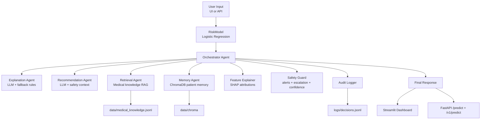

# Architecture Diagram

This diagram is designed for recruiter/interviewer walkthroughs.

## Request Lifecycle (High Level)

1. Validate and normalize input (including BMI calculation).
2. Predict probability and classify risk.
3. Compute SHAP feature impacts.
4. Retrieve similar past cases + relevant medical context.
5. Generate explanation and recommendation.
6. Apply safety assessment (alerts, escalation, confidence).
7. Persist memory and write audit trail.
8. Return structured response to UI/API client.
